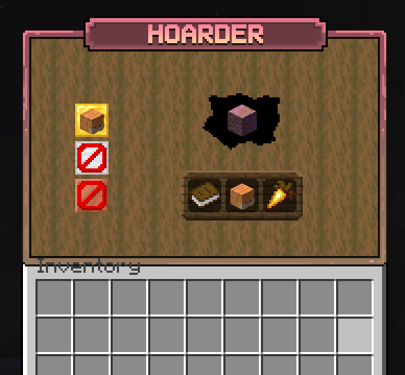

# Hoarder
[spigot page (download jar here)](NOT_UPLOADED_YET)

[support discord](https://discord.gg/QySnx7Vpuh)

---

Bukkit plugin that picks a random item each day, and players have to feed this item to the hoarder for money, the players that feed the most to the hoarder are rewarded with random prizes at the end of the event.

This plugin would make a good addition to any survival or SMP server, adding a bit of competition and gives players a reason to come back each day to a new item to try and collect as much as they can.

This plugin was originally created for the MC Exotic Minecraft server, and you can see it in action on `mcx.life`

## Features
- Data is stored in SQLite database
- Highly configurable via yaml
    - Edit GUI layouts [example](src/main/resources/gui/mainmenu.yml)
    - Configurable via config options in [config.yml](src/main/resources/config.yml)
    - Edit chat messages with [messages.yml](src/main/resources/messages.yml)
- GUI
- Admin commands allowing you to manage the plugin & reload the yaml files
- Leaderboard
- Command system with brigadier

## Screenshots

## Dependencies
- PlaceholderAPI (Not required, but the plugin does support placeholderAPI placeholders in the messages.yml & gui yml files if installed)

## Setup

1. Drag the plugin .jar file to your servers' `plugins/` directory
2. Use the `/hoarder admin` commands to add items to the database and start the event.